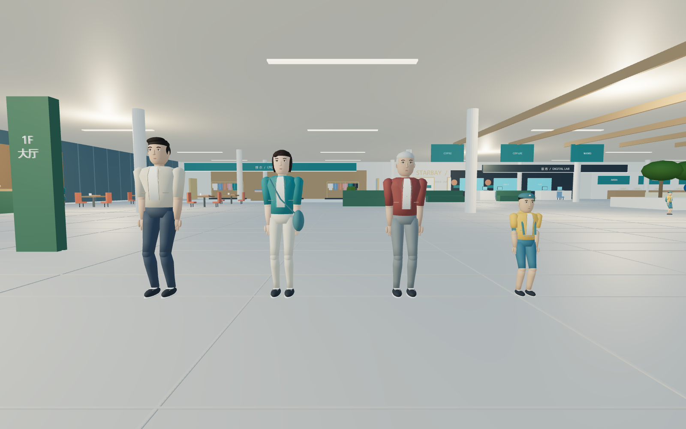
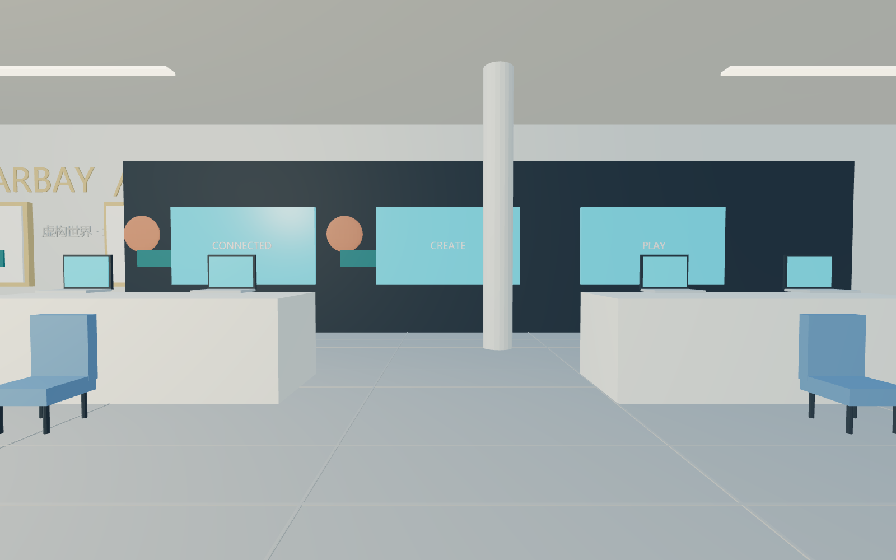

# 星湾街区 · 本地 AI 街区生活

星湾是使用 Blender 与 Three.js 制作的虚构都市游戏世界。地点、商场、商家与人物均为游戏设定，不对应任何真实城市或商业机构。支持进入商场、昼夜变化、委托、存档，以及由本地 Qwen 辅助驱动的虚构居民。



## 下载与运行

[新版中文旁白宣传片与可编辑工程（v5.1.0）](https://github.com/hy-8/starbay-ai-world/releases/tag/v5.1.0)：MiniMax 精英男声，六段短旁白；结尾场景上传生成世界为未来愿景。

[下载 v5.0.0 发布附件](https://github.com/hy-8/starbay-ai-world/releases/tag/v5.0.0)：

- `Starbay-Explorer-v5.0.0.zip`：游戏便携包（需安装 Python 3.10 或更新版本）。
- `Starbay-AI-Promo-Smooth-1080p.mp4`：64 秒 / 1080p / 30 fps 流畅版宣传片。
- `Starbay-Promo-Editable.ccproj`：含素材的本地 OpenChatCut 可编辑视频工程。
- `Starbay-Blender-v5.zip`：主场景与四类人物的 Blender 工程。

下载解压或克隆仓库后，进入 `星湾街区_3D探索`，Windows 双击 `开始探索.cmd`。也可以运行：

```sh
python server.py
```

浏览器通常打开 http://127.0.0.1:8765 。无需 npm 安装；Three.js 和运行模型均已包含。浏览器需支持 WebGL。Blender 不是游玩依赖，只有编辑和重建模型时才需要。

## 本地 AI

安装并启动 Ollama，再下载 `qwen3.5:4b`：

```sh
ollama pull qwen3.5:4b
```

服务默认连接 `127.0.0.1:11434`。可用环境变量 `STARBAY_AI_MODEL` 指定本机已安装模型。未连接 AI 时，探索、任务和普通 NPC 行为仍可运行。

Qwen 理解中文、产生对话并选择目的地；服务校验允许的目的地后，浏览器用路径图、移动逻辑和双腿 IK 执行。模型不直接控制骨骼，也不生成每一帧动作。可对居民说“请带我去口袋公园，我跟着你”。任务目前由本地规则生成，并非模型即时编写。

## 玩法

WASD 移动，鼠标环顾，Shift 快走，Esc 释放鼠标；E 交谈，F 互动，J 打开任务手册。底部“去商场入口”可开始步行入内，“逛商场新店”可直达新增陈设区。

街区包含昼夜循环、12 个探索地点和 8 类委托；一天约 20 分钟。存档保存在当前浏览器本地存储中，同一浏览器与端口可以继续。街区币暂为奖励记录，店内家具暂为视觉探索陈设。



## 架构与重建

完整制作提示词与复用说明见 [复用工作流](复用工作流/README.md)，可用于新项目或继续当前项目。模型和最终画面的关系见 [Blender 与游戏画面为什么不同](复用工作流/03_Blender与游戏画面为什么不同.md)：游戏加载导出的 GLB，灯光、相机和 NPC 动作由运行代码驱动；保存 .blend 不会自动更新游戏。

- `server.py`：Python 标准库本地 HTTP 服务与 Ollama 代理。
- `app.js` / `navigation.js` / `people.js`：Three.js 场景、NPC 意图执行、图寻路、距离驱动步态与双腿 IK。
- `game.js` / `game-ui.js` / `daylight.js`：任务、探索、存档、界面与昼夜光照。
- `build_people_v4.py`：四类原创人物建模；`build_scene.py` 调用 `build_world_v3.py`、`build_interior_v4.py` 生成环境。

使用 Blender 4.5 LTS，在游戏目录依次运行（替换为本机 Blender 可执行路径）：

```sh
blender --background --python build_people_v4.py
blender --background --python build_scene.py -- --skip-preview
```

生成脚本会覆盖对应 GLB 和 .blend 输出；请先保护手工修改的工程。现有 Windows Blender 快捷启动脚本使用制作机 D 盘路径，其他机器请自行通过 Blender 打开发布附件中的 .blend。

## 说明与验证

- [当前游戏使用说明](星湾街区_3D探索/使用说明.md)
- [玩法与 AI 技术说明 PDF](星湾发布/星湾街区生活_玩法与AI技术说明.pdf)（虚构世界版）
- [更新记录](CHANGELOG.md)
- [宣传片流畅度修订记录](星湾发布/发布说明.md)
- [中文旁白脚本与镜头时间](星湾发布/中文旁白脚本.md)

`verify_art_v4.py` 和 `verify_v4_regression.py` 使用 Python Playwright 进行浏览器验证，需另行安装 `playwright` 及 Chromium，并启动本地游戏服务。报告记录包含导航、入口通行、任务/存档、四类步态及页面错误检查。游戏资源无需为了测试而重建。

## 范围与素材

星湾以虚构都市生活为题材，不是实景扫描、数字孪生或真实场馆导览。所有公开名称、品牌标识、AI 设定与视频内容使用虚构世界身份。居民为原创风格化建模。

Three.js 0.180.0 使用 MIT 许可，见 `星湾街区_3D探索/vendor/THREE-LICENSE.txt`。仓库不包含原始参考图片、试验人物模型、Blender 安装程序、Qwen 权重或本地工具凭据。未为整个项目额外授予开源许可。

## 视频封面

- [4:3 横版封面（1448×1086）](星湾发布/封面/星湾_AI世界_4比3.png)
- [3:4 竖版封面（1086×1448）](星湾发布/封面/星湾_AI世界_3比4.png)

封面为AI生成的概念视觉，主题为居民互动与未来玩家创造世界，不代表当前游戏实机画质。上传场景生成三维世界仍为未来愿景。两版分别构图，保留[生成提示词](星湾发布/封面/生成提示词.json)。
