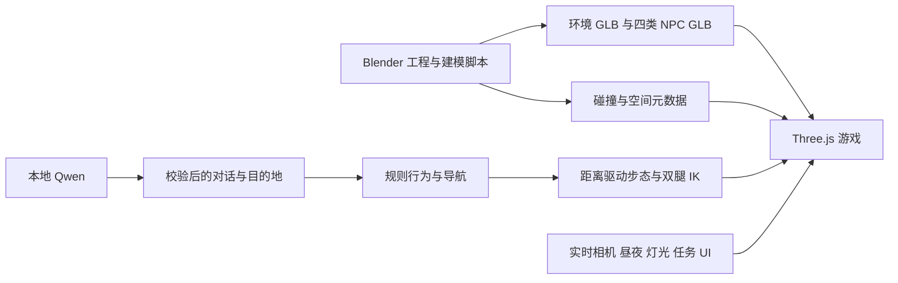

# Blender 与最终游戏是什么关系？

有直接关系：游戏里的建筑、商场陈设和四类 NPC 使用了 Blender 导出的模型。但游戏不会打开或播放 `.blend` 文件；它加载的是 GLB，并由 Three.js 和游戏代码重新渲染、布光与驱动人物。

## 已核对的区别

| 项目 | Blender 当前生成工程/预览 | 最终浏览器游戏 |
|---|---|---|
| 建筑和陈设 | 建模源文件中的几何与材质 | `assets/starbay_environment.glb` 中的导出几何与材质 |
| 渲染方式 | Cycles，32 采样及降噪 | Three.js WebGLRenderer，实时阴影 |
| 色彩映射 | AgX | ACES Filmic；曝光还随昼夜调整 |
| 天空与主光 | 固定 Nishita 天空与偏傍晚太阳 | 持续变化的太阳、天空、雾、月亮、星光和夜灯 |
| 相机 | 固定预览机位、27 mm 镜头 | 64° 视野的交互相机，游玩时约 1.72 m 视高 |
| NPC 数量 | 环境导出后才加入的 8 个预览人物 | 另载四类人物 GLB，实例化 12 位居民 |
| 人物动作 | 为 Blender 预览烘焙的循环和直线路径 | 根据实际位移实时求步态、落脚和关节旋转，受导航与行为影响 |
| 开门、任务、对话 | 不等于游戏运行逻辑 | JavaScript 与本地服务执行 |

`build_scene.py` 导出环境时只选择网格/文字对象，没有把 Blender 相机、太阳和世界天空一起导给游戏。即使几何一致，光照、阴影、反射和颜色也不会自然一致。若 Blender 当前显示的是“实体”视图，差异还会更大，因为那不是完整渲染效果。

四类人物由 `build_people_v4.py` 导出时设置 `export_animations=False`。目前人物主要由分段网格和 13 个具名关节节点组成，游戏的 `people.js` 计算动作。因此 Blender 时间线里的人物走法，并不是最终游戏走法的完整预演。

以上来自当前生成脚本与游戏代码。若后来手工改过 .blend，实际工程参数还需以打开后的文件为准。

## 应该打开哪个文件？

当前主工程是 [星湾街区.blend](../星湾街区_3D探索/星湾街区.blend)。历史文件夹中的 .blend 可能对应早期版本，不能用来判断当前游戏是否一致。

若比较的是两张宣传封面，它们是另行生成的 AI 概念图，已经标为“概念封面”，不是 Blender 渲染或当前游戏实机画质。宣传视频的主体则来自游戏实机采集，再加入剪辑动效。

## 修改 Blender 后，怎样让游戏一起改变？

保存 .blend 并不会自动更新游戏。正确顺序是：

1. 备份手工编辑后的工程，确认修改的是当前活动版本。
2. 从该工程导出应进入游戏的对象到对应 GLB，保持坐标、比例、材质和具名对象协议。环境导出排除 Blender 专用预览人群，人物单独导出。
3. 建筑布局改动要同步 `scene.json` 等碰撞信息以及 `navigation.js`/相关代码中的路线和兴趣点；人物比例改动要同步 `npc_catalog.json` 和动作参数。只改材质通常不需要改导航。
4. 刷新游戏并确认没有加载旧缓存，验证外观、门口通行、碰撞与人物步态。

不要直接重跑原生成脚本来“同步”手工编辑：脚本会按代码重新建模，可能把手工改动覆盖掉。需要长期复用的修改，应纳入建模脚本或单独的受控导出流程。

## 怎样把两边调得更接近？

先选游戏固定时刻与固定机位，在 Blender 中匹配主光方向、曝光和相机视角，再对照材质、阴影和反射；最终以玩家实际看到的游戏效果为验收依据。可以进一步做共享材质参数、导出清单和截图对比，必要时用 Eevee 辅助检查实时效果，但不同渲染器不会保证像素级一致。
