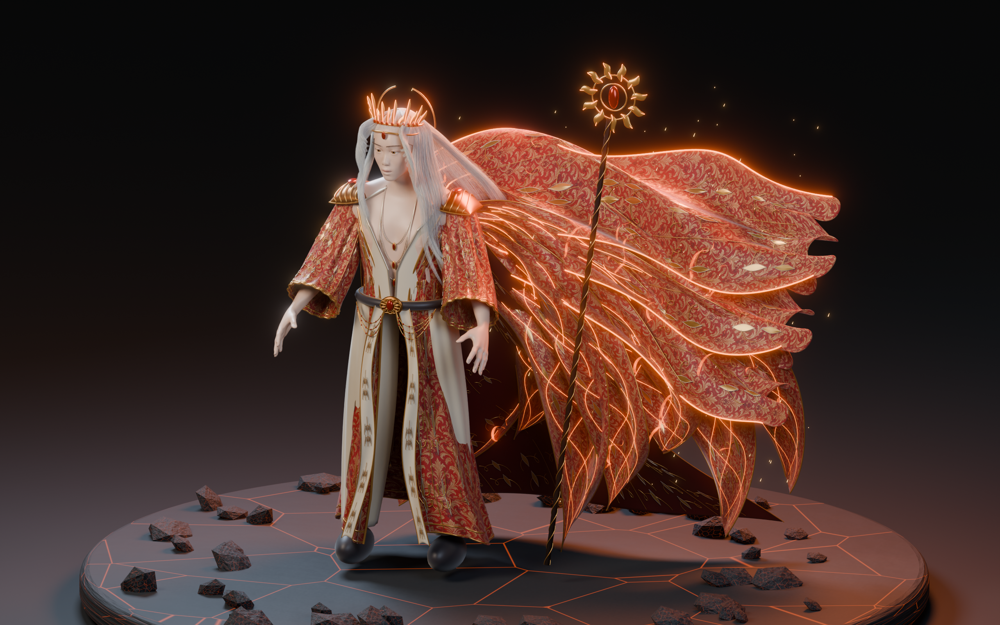

# 焰冕行者 · 男款红金织锦精修

当前交付是 **真实 Blender 静态展示模型**，最新候选为 `v11` / Release v0.2.0；初版 v04 和历史 Release 保留。本轮从 v05 至 v11 反复检查实际渲染，重做面部形体、白发、开襟长袍、织锦材质、配饰和熔火披风。它仍不是已绑定的 UE 可操控角色，也不应把当前面部、服装塑形说成已达到参考商业游戏的最终质量。



## 本轮变化

- 使用 15 个明确标注 CC0 的形体目标细调眼睑、鼻梁、唇形和轮廓，增加虹膜纹理、眉毛与睫毛几何；头部改为略低头的三分之四姿态。
- 白发改成数千根独立的细曲线，包含额前弯曲发束、垂落长发和顺风发丝。仍是静态展示几何，不是 UE Groom 或完成模拟的发型。
- 重做 V 形内搭、宽袖、长摆、腰带、挂链、肩饰和贴合衣面的金线/叶形浮雕；并给服装建立 UV。
- 用内置 image_gen 制作原创红金织锦 Albedo，并在 Blender 烘焙 ORM 和切线空间法线，实际应用到衣服与披风。贴图、提示词和生成方式保留在 `Materials/`。
- 披风由窄长分片、宽幅飘动面料和拖尾薄纱叠成；`08_EmberFX` 单独保存火焰薄片与余烬。姿态和火焰是静态造型，不是流体或布料模拟。
- 保存 2560×1600 展示图，以及正面、背面、肖像、关闭特效的素光图和织锦近景。全部来自本次 Blender 工程，没有用生成的人物效果图替代建模结果。

## 文件

- `Exports/v11/Ember_Regent.blend`：可编辑 Blender 4.5 工程，包含分件几何、细发丝、静态火焰、灯光与相机。完整 CC0 人体保留在隐藏源对象中。
- `Exports/v11/Ember_Regent_Static.glb`：嵌入织锦贴图的静态模型；不含展示台、独立火焰薄片、余烬、相机和灯光。
- `Exports/v11/Ember_Regent_Static.fbx`：静态分件导出，供资产准备使用；不同软件对 FBX 材质解释可能不同，优先以 GLB 和 Blender 工程为材质参照。
- `Renders/v11/`：六张实际渲染；`05_Neutral.png` 用于检查关闭火焰/辉光的造型。
- `Tools/build_couture.py`：新版参数化脚本，复用 `build_character.py` 的初始化与人体读取，不复用其旧服装。使用全新版本目录，保护已有 `.blend`。
- `Tools/bake_textile.py`：织锦 ORM 与法线的真实 Cycles 烘焙；已有输出时拒绝覆盖。
- `Tools/export_couture.py`：在独立后台会话导出，不保存或覆盖源 Blender 工程。
- `Tools/verify_exports.py`：独立回读检查，结果在 `Exports/v11/verification.json`。
- `Source/`：CC0 人体及形体目标；下载地址、权重和校验和见两个 sources JSON，原文件随 Release 附带。

下载包：[红金织锦精修 Release](https://github.com/hy-8/starbay-ai-world/releases/tag/character-ember-v0.2.0)。Git 保存脚本、说明、贴图、预览及验证报告；`.blend`、FBX、GLB、原始形体文件放在附件里。[初版 v0.1.0](https://github.com/hy-8/starbay-ai-world/releases/tag/character-ember-v0.1.0) 保留。

## 造型与实现

参考方向为红金幻想礼服、白色长发、贵族法师气质。冠饰重做为断裂日轮，披风拆成七片焰羽，外袍采用开襟长摆、象牙色内搭、黑色宽裤和独立金属边饰。没有提取原游戏模型、纹理、标识或将参考图贴在几何上。改变配色本身不足以确立设计独立性；后续仍需继续调整剪裁、装饰语言和人物面相。

人体采用 MakeHuman 明确标注 CC0 的基础网格、男性形体及面部目标。脚本构建服装曲面、曲线镶边、披风、发丝和冠饰。Cycles 渲染使用独立摄影棚灯光；织锦已烘焙贴图便于导出。皮肤微凹凸、火焰混合着色和辉光等效果仍需在 UE 中重建，不能把 Blender 渲染当作 UE 实机。

展示模型分件和发丝几何较多，不以运行时性能为目标。实际面数、尺寸以验证 JSON 为准。皮肤目前是艺术化肤色、局部颜色变化与程序微细节，未制作完整照片级面部纹理；衣褶、面部神态和披风连接处还可继续精雕。没有骨骼、皮肤权重、实时粒子、布料物理或行走变形验收。

## 后续进入游戏

1. 先精修脸部、发际线和服装褶皱，补完整 UV 与皮肤、金属、织物纹理。
2. 做游戏低模、烘焙与 LOD，合并适当材质/装饰，保留替装边界。
3. 建立骨骼和蒙皮；测试肩肘、手指、髋膝变形，给长袍与披风设计辅助骨骼/布料约束。
4. 在 UE5 导入骨骼网格，制作 IK Retargeter，接入走、跑、跳、落地与角色控制器；单独验证穿模、碰撞、性能。
5. NPC 的 Qwen 高层意图交给游戏中的导航与动画系统执行。这个静态模型本身不含本地 AI，不会因导出 FBX 自动获得行为。

## 重建

下载角色附件并把 `Source`、`Materials` 放回本目录后，在本目录执行：

```powershell
& 'D:\tools\Blender\blender-4.5.9-windows-x64\blender.exe' --background --factory-startup --python '.\Tools\build_couture.py' -- v12
& 'D:\tools\Blender\blender-4.5.9-windows-x64\blender.exe' --background --factory-startup --python '.\Tools\export_couture.py' -- v12
& 'D:\tools\Blender\blender-4.5.9-windows-x64\blender.exe' --background --factory-startup --python '.\Tools\verify_exports.py' -- v12
```

脚本只允许后台 Blender，且拒绝覆盖已有目标 `.blend`。任何手工修改应另存，不要通过删除保护文件强行重跑覆盖。
