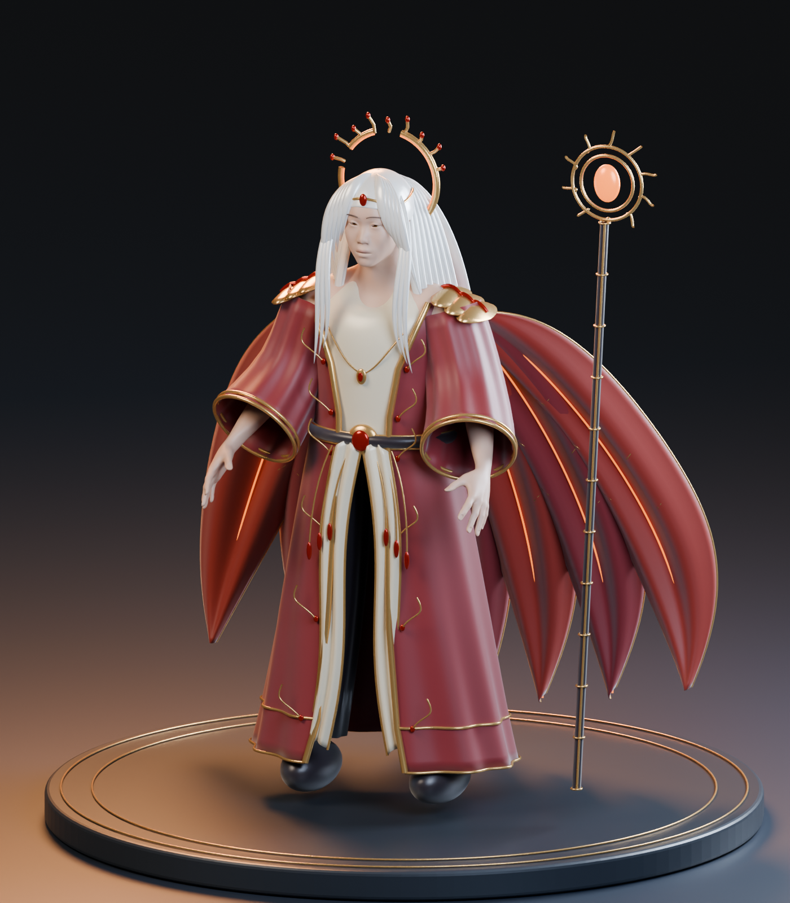

# 焰冕行者 · 男款角色建模初版

当前交付是 **真实 Blender 静态模型与造型研究**，用于继续雕刻、制衣和角色制作。四轮本地检查后的候选为 `v04`。它尚未达到参考图中商业游戏珍品皮肤的精细度，也不是已接入 UE 的可操控角色。



## 文件

- `Exports/v04/Ember_Regent.blend`：可编辑 Blender 4.5 工程，分身体、内搭、外袍、披风、头发、冠饰、法杖和展示台。完整 CC0 人体保留在隐藏源对象中；显示身体裁掉被衣服覆盖的部分。
- `Exports/v04/Ember_Regent_Static.glb`：静态模型，可回读；不含展示台、相机与灯光。
- `Exports/v04/Ember_Regent_Static.fbx`：静态分件导出，供引擎资产准备使用。
- `Renders/v04/`：全身三分之四角度、正面、背面和肖像，均由本次 `.blend` 实际渲染，不是图片生成效果。
- `Tools/build_character.py`：参数化制作脚本，使用全新版本目录，保护既有 `.blend`。
- `Tools/verify_exports.py`：独立 Blender 回读检查，结果在 `Exports/v04/verification.json`。
- `Source/`：CC0 人体与男性形体目标；下载链接、校验和见 `sources.json`，二进制源随 Release 附带。

下载包：[角色初版 Release](https://github.com/hy-8/starbay-ai-world/releases/tag/character-ember-v0.1.0)。Git 保存脚本、说明、预览及验证报告；`.blend`、FBX、GLB 和源 OBJ 放在附件里。

## 造型与实现

参考方向为红金幻想礼服、白色长发、贵族法师气质。冠饰重做为断裂日轮，披风拆成七片焰羽，外袍采用开襟长摆、象牙色内搭、黑色宽裤和独立金属边饰。没有提取原游戏模型、纹理、标识或将参考图贴在几何上。改变配色本身不足以确立设计独立性；后续仍需继续调整剪裁、装饰语言和人物面相。

人体采用 MakeHuman 明确标注 CC0 的基础网格及男性形体目标。脚本构建服装曲面、曲线镶边、披风、发束和冠饰，保存为可编辑分件。Cycles 渲染使用独立摄影棚灯光；导出保留基础 PBR 因子与几何。Blender 程序化织物微凹凸不会自动变成 UE 材质，需要烘焙或在引擎里重建。

展示模型分件较多，不以运行时性能为目标。导出网格和实际三角形数量、尺寸以验证 JSON 为准。脸部只有基础造型与简单肤色，头发使用实体发束，火焰目前是静态发光镶边；没有真实发丝系统、粒子火焰或布料模拟。

## 后续进入游戏

1. 先精修脸部、发际线和服装褶皱，补完整 UV 与皮肤、金属、织物纹理。
2. 做游戏低模、烘焙与 LOD，合并适当材质/装饰，保留替装边界。
3. 建立骨骼和蒙皮；测试肩肘、手指、髋膝变形，给长袍与披风设计辅助骨骼/布料约束。
4. 在 UE5 导入骨骼网格，制作 IK Retargeter，接入走、跑、跳、落地与角色控制器；单独验证穿模、碰撞、性能。
5. NPC 的 Qwen 高层意图交给游戏中的导航与动画系统执行。这个静态模型本身不含本地 AI，不会因导出 FBX 自动获得行为。

## 重建

在仓库下载角色附件并把 `Source` 放回本目录后：

```powershell
& 'D:\tools\Blender\blender-4.5.9-windows-x64\blender.exe' --background --factory-startup --python '.\Tools\build_character.py' -- v05
& 'D:\tools\Blender\blender-4.5.9-windows-x64\blender.exe' --background --factory-startup --python '.\Tools\verify_exports.py' -- v05
```

脚本只允许后台 Blender，且拒绝覆盖已有目标 `.blend`。任何手工修改应另存，不要通过删除保护文件强行重跑覆盖。
