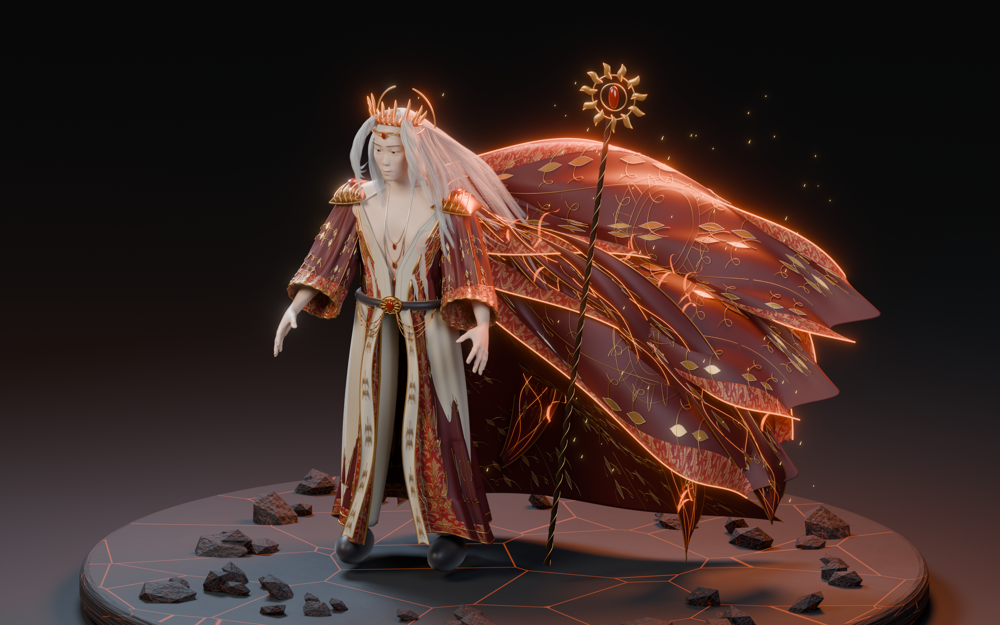

# 焰冕行者 · 红金礼服角色

当前候选为 **v14 / Release v0.3.0**，是可编辑的 Blender 静态展示模型。v04、v11 及历史发布完整保留。本版改善发束、服装的材质层次及饰件连接，但面部精雕、自然布料塑形仍与参考的商业游戏角色有差距；尚未绑定，也没有替换 UE 游戏角色。



## v0.3.0 的变化

- 收紧静止唇形，调整面颊和下巴，补充眼下肤色变化与程序微凹凸；保留原始 CC0 人体及 15 个面部目标的可追溯来源。
- 重新安排额前分发、不同长度的侧发和后发；发束使用圆形截面分布、不同卷曲相位、渐细末梢，另加细散发。仍使用真实曲线几何，并非生成的人物图片。
- 外袍、袖子和宽幅披风改用深红主料，把织锦集中在门襟、下摆、袖口和披风镶边，减少满铺重复纹样。修改衣褶、内搭领口包边，并保留立体金线。
- 披风减少整齐的窄片，调整宽幅布面的起伏与落点，新增太阳纹章。金线沿局部表面法线偏移，降低深褶处饰线埋入布面的情况；这些仍是静态塑形。
- 王冠增加卷纹、宝石爪镶、额饰细珠边；肩饰增加卷曲纹和珠边；项链后段改为沿真实颈部表面拟合，并跟随头颈姿态的过渡形变。
- 经过 v12 草图、v13 和 v14 实际渲染检查。交付六视角，包括关闭火焰、辉光与彩色灯光的素光检查图。

## 文件与下载

- `Exports/v14/Ember_Regent.blend`：Blender 4.5 工程，分件模型、细发丝、静态火焰、灯光、相机及隐藏的完整源人体。
- `Exports/v14/Ember_Regent_Static.glb`、`.fbx`：静态模型，不含展示台、独立火焰、余烬、相机和灯光。GLB 嵌入织锦 PBR 贴图；FBX 跨软件材质解释可能不同。
- `Exports/v14/manifest.json`、`verification.json`：文件校验和、实际几何数量和 Blender 独立导入验证结果。
- `Renders/v14/`：展示图、正面、背面、肖像、素光与刺绣近景，均由当前 3D 模型渲染。
- `Open-Character.ps1`：在新的 Blender 窗口打开当前模型，不关闭已有窗口。
- `Tools/build_couture.py`：当前生成器；使用新版本目录，拒绝覆盖已有 `.blend`。`build_character.py` 保留作为原版和基础读取依赖。
- `Tools/export_couture.py`、`verify_exports.py`：独立后台导出与回读检查；导出不会重存源工程。
- `Tools/bake_textile.py`：织锦 ORM 与切线空间法线的 Cycles 烘焙。
- `Tools/package_character.py`：核对模型哈希后打包单个版本，进行 ZIP CRC 检查，排除原参考图、旧候选、日志与 `.blend1`。
- `Source/`、`Materials/`：人体、面部目标、来源校验、贴图与生成记录；第三方声明见 `THIRD_PARTY_NOTICES.md`。

[下载 v0.3.0 模型与制作源文件](https://github.com/hy-8/starbay-ai-world/releases/tag/character-ember-v0.3.0)。Git 保存脚本、说明、贴图、预览与报告；大型 `.blend`、FBX、GLB 和原始形体文件随 Release 提供。[v0.2.0](https://github.com/hy-8/starbay-ai-world/releases/tag/character-ember-v0.2.0) 与 [v0.1.0](https://github.com/hy-8/starbay-ai-world/releases/tag/character-ember-v0.1.0) 保留。

## 实现与当前边界

人体来自 MakeHuman 的明确 CC0 资产。Python 构建服装曲面、曲线镶边、披风、发丝和饰件，再用 Cycles 渲染。服装 UV 上的原创织锦底色由 image_gen 生成，ORM 与法线在 Blender 中实际烘焙；提示词见 `Materials/texture_provenance.json`。本版没有新增外部参考资产或把人物效果图当作模型成果。

造型取红金礼服、长白发、火焰法师的方向；断裂日轮冠、太阳纹章、开襟剪裁与饰件由脚本构造。用户参考图及游戏标识未打包或上传。改变配色本身不等于完成独立设计审查。

此模型以展示为目标，独立发丝与饰件带来较高几何数量，不是运行时优化版本。皮肤是局部顶点色和程序细节，尚无完整写实面部贴图；披风仍有较强参数化曲面感。没有骨骼、权重、动作、动态布料、UE Groom 或引擎内验收。Blender 灯光、程序材质及静态火焰也不会自动变成 UE 实机效果。

## 后续重点

1. 继续面部精雕、发际线和真实肤质贴图，检查近距离眼睑、嘴角与表情。
2. 用服装裁片与布料模拟改善披风和长袍的受力褶皱，并检查肩部连接和穿模。
3. 制作游戏低模、发片或 Groom、纹理烘焙与 LOD；减少不必要的物体和材质切换。
4. 建立骨骼、蒙皮、披风辅助骨骼，在 UE5 验收走、跑、跳、落地及碰撞。
5. 接入角色控制器后，再把 Qwen 的高层意图交给导航和动画系统；静态模型本身没有 AI 行为。

## 重建

先将 Release 中的 `Source`、`Materials` 恢复到本目录，再选择尚不存在的版本名：

```powershell
& 'D:\tools\Blender\blender-4.5.9-windows-x64\blender.exe' --background --factory-startup --python '.\Tools\build_couture.py' -- v15
& 'D:\tools\Blender\blender-4.5.9-windows-x64\blender.exe' --background --factory-startup --python '.\Tools\export_couture.py' -- v15
& 'D:\tools\Blender\blender-4.5.9-windows-x64\blender.exe' --background --factory-startup --python '.\Tools\verify_exports.py' -- v15
```

任何手工修改应另存。不要删除保护文件来强行覆盖；历史版本可从相应 Release 恢复，旧脚本版本可从对应 Git 提交取得。